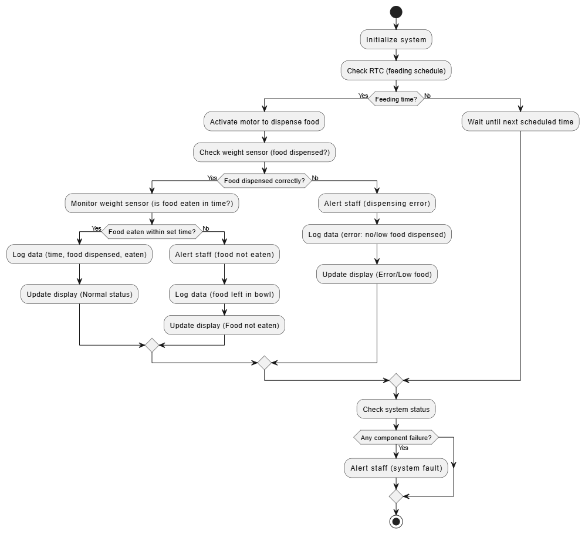

# Automated Pet Feeder System

## 📌 Project Overview
This project designs a **low-cost automated pet feeder** for a local animal shelter.  
The feeder ensures that **cats and dogs receive the right amount of food at scheduled times**, while also **monitoring consumption** and **alerting staff in case of issues**.

The system uses a combination of sensors, actuators, and communication modules to automate feeding, track food intake, and provide alerts for errors or unusual conditions.

---

## 🎯 Features
- **Scheduled Feeding**: Dispenses food at fixed times (8:00 AM, 11:00 AM, and every 3 hours thereafter).
- **Portion Control**: Dispenses specific food quantities (e.g., Cats: 80g, Dogs: 200g).
- **Consumption Monitoring**: Tracks whether food is eaten within a set timeframe.
- **Error Detection**: Detects if food is not dispensed, insufficient, or uneaten.
- **Alerts**: Notifies staff via buzzer or mobile app (using Wi-Fi/GSM).
- **Data Logging**: Records feeding times, amounts dispensed, and consumption data.
- **Status Display**: Uses LEDs or indicators for quick status updates (OK, Error, Low Food).

---

## ⚙️ System Components

### Inputs
- **Real-Time Clock (RTC)** – Maintains feeding schedule.  
- **Weight Sensor** – Measures food dispensed and eaten.  
- **Feeding Schedule** – Pre-programmed for cats and dogs.  
- **Network Connectivity** – Wi-Fi/GSM for remote alerts.

### Outputs
- **Motor Control** – Dispenses food at set times.  
- **LED Indicators** – Green (OK), Yellow (Low Food), Red (Error).  
- **Alerts** – Push notification or buzzer warning staff.  
- **Data Logger** – Stores last 30 days of feeding history.

---

## 🧩 System Workflow

---

## 📊 Data Constraints

| Component       | Constraint |
|-----------------|------------|
| RTC             | ±2 sec/day drift, reset after power failure |
| Weight Sensor   | ±2g accuracy, max 2kg, sensitive to vibration |
| Feeding Schedule| Limited slots due to microcontroller memory |
| Network         | May fail in weak signal areas, delays possible |
| Data Logger     | Stores ~30 days only (overwrites old data) |

---

## 🚧 Assumptions & Limitations
- Motors or sensors may fail, leading to errors.  
- RTC is battery-dependent.  
- Alerts may be delayed in unstable networks.  
- Animals eat from the feeder without interference.  
- Only one type/quantity of food provided.  

---

## 📁 Project Files
- **Step 1 - Problem Analysis.pdf** → Defines the problem and requirements.  
- **Step 2 - Organize and Describe Data.pdf** → Structures input/output data with constraints.  
- **Step 4 - Word Code.pdf** → Provides the algorithmic workflow (pseudo-code).  

---

## 🚀 Future Improvements
- Add camera vision to detect animals eating.  
- Support multiple food types.  
- Expand storage for longer feeding history.  
- Improve alert system with redundant notifications.  
